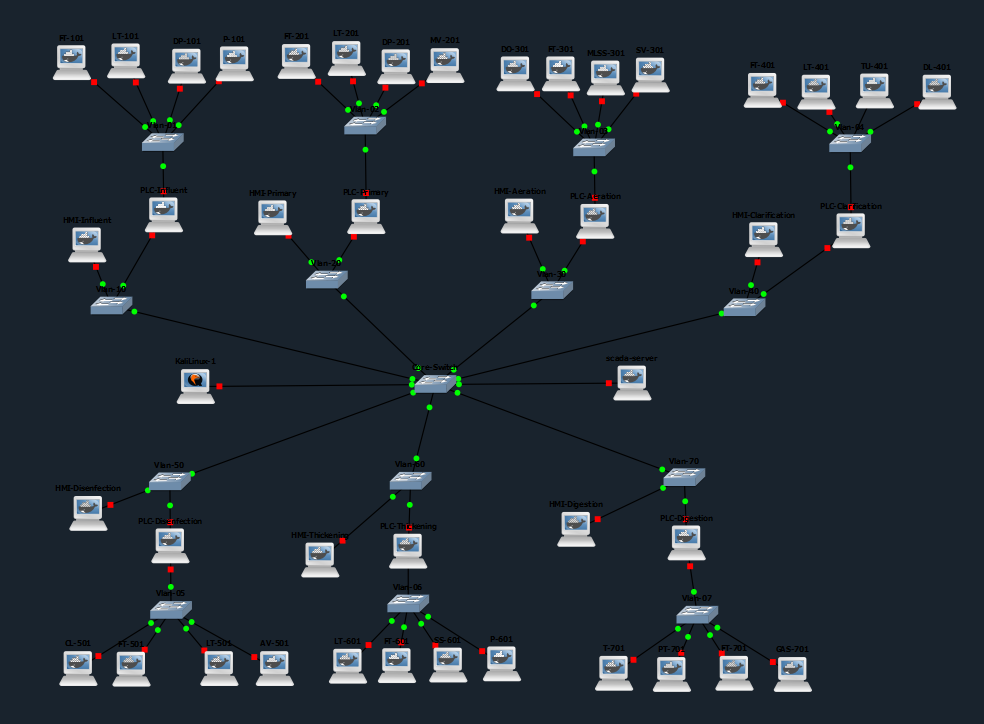
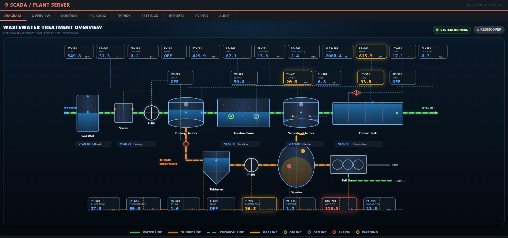
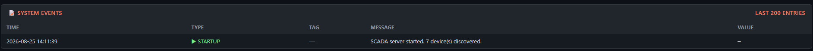

# Industrial Control Systems (ICS) & SCADA Sandbox

A reproducible **ICS/OT cyber range** built with **GNS3, Docker, Python, Modbus TCP, Flask, and Jenkins**.

This project simulates a segmented wastewater treatment facility with seven PLCs, HMIs, field devices, centralized SCADA, and a dedicated security workstation.

The environment is designed to be **automated, reproducible, observable, and suitable for authorized security research**.

---

## What I Built

This project combines infrastructure automation, networking, industrial protocols, application development, and cybersecurity into one virtualized environment.

### Key Engineering Work

**Infrastructure Automation**
Programmatically deploys the GNS3 topology using Python and the GNS3 API instead of manually creating and configuring the environment.

**ICS Networking**
Implements segmented process networks with multi-interface PLCs separating field-device communications from supervisory systems.

**Industrial Communications**
Uses Modbus TCP for PLC/SCADA communications and validates communication independently from the application layer.

**Automatic Device Discovery**
Implements a metadata-driven discovery system that allows SCADA to identify PLCs and interpret their process data dynamically.

**SCADA Application**
Provides a Flask-based monitoring platform with live process values, alarms, historical data, trends, reporting, device discovery, and PLC interaction.

**CI/CD Automation**
Uses Jenkins to automate the topology deployment workflow and reduce manual configuration.

**Systems Troubleshooting**
Debugged failures across Linux networking, TCP connectivity, Modbus communication, PLC metadata, SCADA discovery, and application availability.

---

## Architecture

```text
                         ┌──────────────────────┐
                         │       Jenkins        │
                         │   Deployment Pipeline│
                         └──────────┬───────────┘
                                    │
                                    ▼
                         ┌──────────────────────┐
                         │    Python / GNS3     │
                         │    Topology Builder  │
                         └──────────┬───────────┘
                                    │
                                    ▼
                         ┌──────────────────────┐
                         │        SCADA         │
                         │ Dashboard / Discovery│
                         │ Historian / API      │
                         └──────────┬───────────┘
                                    │
                         SCADA / Control Network
                                    │
             ┌──────────┬──────────┼──────────┬──────────┐
             │          │          │          │          │
            PLC        PLC        PLC        PLC       PLC ...
             │          │          │          │
            HMI        HMI        HMI        HMI
             │          │          │          │
          Field      Field      Field      Field
         Devices    Devices    Devices    Devices

                         +
                  Kali Linux Workstation
```

The environment contains seven simulated process areas:

| Process Area  | PLC               | Example Devices                           |
| ------------- | ----------------- | ----------------------------------------- |
| Influent      | PLC-Influent      | Flow, level, differential pressure, pump  |
| Primary       | PLC-Primary       | Flow, level, differential pressure, mixer |
| Aeration      | PLC-Aeration      | Dissolved oxygen, flow, MLSS, blower      |
| Clarification | PLC-Clarification | Flow, level, turbidity, dosing            |
| Disinfection  | PLC-Disinfection  | Chlorine, flow, level, valve              |
| Thickening    | PLC-Thickening    | Level, sludge flow, solids, pump          |
| Digestion     | PLC-Digestion     | Temperature, pressure, gas flow, actuator |

---

## SCADA

The SCADA platform communicates with the simulated PLCs using **Modbus TCP**.

Core functionality includes:

* Automatic PLC discovery
* Metadata validation
* Live process monitoring
* Aggregate PLC sensor data
* Alarm and status evaluation
* Historian and trend data
* Daily reporting
* Sensor control
* PLC logic management
* Web-based process visualization

### Device Discovery

Each PLC exposes a structured metadata block through Modbus TCP.

The SCADA client reads and validates this metadata before identifying the PLC and retrieving its process data.

```text
SCADA
  │
  │ Modbus TCP
  ▼
PLC Metadata
  │
  ├── Protocol Version
  ├── Device Type
  ├── Device Class
  ├── Device Tag
  └── Data Configuration
  │
  ▼
PLC Identified
  │
  ▼
Aggregate Process Data
  │
  ▼
SCADA Dashboard
```

The completed environment successfully demonstrated communication with and automatic discovery of **seven simulated PLCs**.

---

## Network Design

The laboratory separates field communications from higher-level supervisory communications.

Each PLC has:

```text
Field Interface
      │
      ▼
Field Devices

Process Interface
      │
      ├── HMI
      └── SCADA
```

This architecture provides:

* Process segmentation
* Multi-interface PLCs
* Separation of field and supervisory traffic
* Independent process areas
* Isolated troubleshooting domains
* A controlled environment for security testing

Environment-specific infrastructure addresses are intentionally excluded from the public repository.

---

## Automated Deployment

The topology is created through the GNS3 API.

```text
Jenkins
   │
   ▼
Python Deployment
   │
   ▼
GNS3 API
   │
   ├── Create Project
   ├── Create Nodes
   ├── Configure Interfaces
   ├── Create Links
   └── Start Devices
   │
   ▼
Validation
   │
   ▼
Operational ICS Environment
```

The deployment code is designed to reduce manual GNS3 configuration and make the laboratory reproducible.

---

## Validation & Troubleshooting

The environment is validated progressively rather than assuming that successful topology creation means the laboratory is operational.

```text
GNS3 Topology
      ↓
Network Interfaces
      ↓
Routing / Connectivity
      ↓
TCP Services
      ↓
Modbus TCP
      ↓
PLC Metadata
      ↓
SCADA Discovery
      ↓
SCADA Application
```

During development, this process was used to isolate failures at different layers.

One significant issue involved a mismatch between the metadata contract and the number of registers requested by the SCADA discovery client. Direct Modbus testing against the PLC was used to isolate the problem before correcting the discovery logic.

This resulted in successful discovery of all seven simulated PLCs.

---

## Technology Stack

* **Python**
* **GNS3**
* **Docker**
* **gns3fy**
* **Modbus TCP**
* **Flask**
* **Jenkins**
* **Linux networking**
* **Wireshark**

---

## Repository Structure

```text
.
├── README.md
├── deployment/
├── Topology/
├── SCADA/
├── Jenkins/
└── Screenshots/
```

### `deployment/`

Python automation for building and configuring the GNS3 environment.

### `Topology/`

Network architecture and topology documentation.

### `SCADA/`

SCADA application, Modbus device client, metadata handling, historian, models, and web interface.

### `Jenkins/`

CI/CD pipeline used to automate deployment.

### `Screenshots/`

Selected screenshots demonstrating the topology, SCADA application, and PLC discovery.

---

## Security Research

The laboratory is designed for **authorized and isolated cybersecurity experimentation**.

A Kali Linux security workstation can be used to study:

* Network reconnaissance
* Industrial protocol exposure
* Modbus TCP
* SCADA asset discovery
* Packet analysis
* Detection and monitoring
* Defensive security controls

No testing is intended for production systems or infrastructure without explicit authorization.

---

## Public Repository Safety

The public version intentionally excludes:

* Credentials
* API keys and tokens
* Private server addresses
* Internal hostnames
* VPN configuration
* Production network information
* Environment-specific secrets
* University-specific infrastructure
* Proprietary course materials

Environment-specific values are supplied through local configuration or environment variables.

---

## Screenshots

### GNS3 Topology



### SCADA Dashboard



### PLC Discovery



---

## Future Development

Potential extensions include:

* ICS intrusion detection
* Modbus traffic analysis
* Security monitoring and alerting
* Automated security validation
* Additional process simulations
* More realistic PLC control logic
* Red-team / blue-team exercises
* Cloud-connected OT monitoring

---

## Disclaimer

This project is intended for **education, experimentation, cybersecurity research, and defensive security testing in isolated laboratory environments**.

It is not intended for deployment against real industrial control systems or production infrastructure without explicit authorization.
